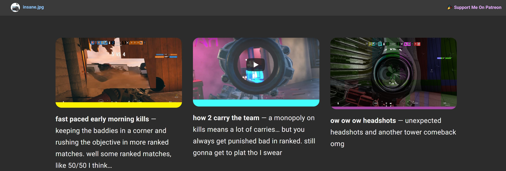

# insane.pw

🎳 website for insane.jpg siege youtube videos

# usage

> insane.pw uses the [barber-jekyll](https://github.com/samesies/barber-jekyll#installation) theme

- install with `bundle install` ([install Bundler](https://bundler.io/)) 
- serve with `npm start` (`bundle exec jekyll serve`) to see your development site
- deploy with `npm run build` (`bundle exec jekyll build`) to build a production ready site
- sync with `npm run youtube` (`node insane_sync.js`) to create a new post from the latest insane.jpg youtube video

# about

- created by [insanj](https://github.com/insanj) (Julian Weiss) 
- licensed under [GPL-3.0](LICENSE)
- [published site](https://insane.pw) copyright 2018
- reach out on [youtube](https://youtube.com/insanj)
