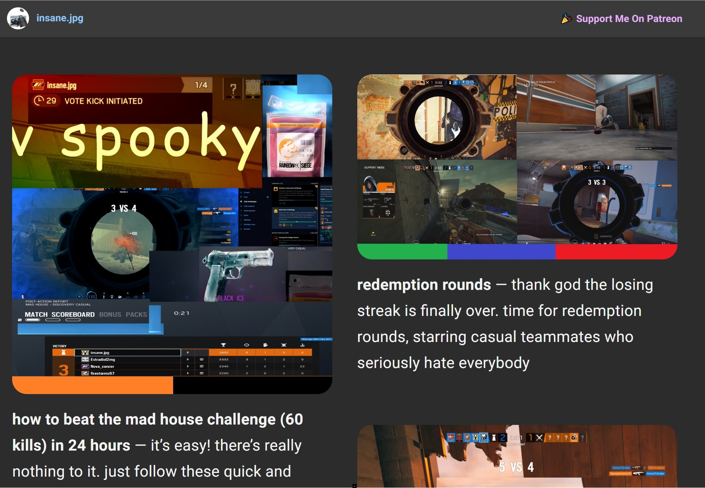

<h1 align="center">insane.pink</h1>
<h4 align="center">🎳 website for insane.jpg siege youtube videos.</h4>

| 🚀 Production | 👾 Development | 📺 Video Material | 🏆 Support | 🔨 Issues | 🆘 Help
| ------------- | ------------- | ------------- | ------------- | ------------- | ------------- | 
| [insane.pw](https://insane.pw) | [insane.pink](https://insane.pink) | [youtube.com/insanj](https://youtube.com/insanj) | [patreon.com/insanj](https://patreon.com/insanj) | [github.com/insanj](https://github.com/insanj) | [contact](mailto:github@insanj.com)
| Google Cloud  | Github Pages | Youtube | Patreon | Github | Email




## Table of Contents
1. [Usage](#usage)
2. [Setup](#setup)
3. [About](#about)

# Usage

- install with `bundle install` ([install Bundler](https://bundler.io/)) 
- serve with `npm start` (`bundle exec jekyll serve`) to see your development site
- build with `npm run build` (`bundle exec jekyll build`) to get a production ready site
- sync with `npm run youtube` (`node insane_sync.js`) to create a new post from the latest insane.jpg youtube video
- deploy with `jekyll build --destination docs && gcloud app deploy` which both generates a static site for [Github Pages](https://insane.pink) and [Google Cloud](https://insane.pw)

> NOTE: insane.pw uses the [barber-jekyll](https://github.com/samesies/barber-jekyll#installation) theme

# Setup

## Google Cloud

### 🏮 Jekyll-App-Engine


1. https://github.com/jamesramsay/jekyll-app-engine

> NOTE: 🎉 the current deployment uses this plugin! check out the [app.yaml](app.yaml) and [_config.yml](_config.yml), which both include very important details

### 💎 Custom (Docker) Environment App

1. install [docker on your local machine](https://docs.docker.com/install/linux/docker-ce/ubuntu/#set-up-the-repository) in order to test the custom environment
2. ensure the docker service is running (may require running the following command on Linux/Ubuntu subsystem: `sudo nohup docker daemon -H tcp://0.0.0.0:2375 -H unix:///var/run/docker.sock &`)
3. create a `Dockerfile` that will run automatically once your `app.yaml` has `env: custom`:
```dockerfile
# NODEJS
FROM gcr.io/google_appengine/nodejs
COPY . /app/
RUN npm install --unsafe-perm || \
  ((if [ -f npm-debug.log ]; then \
      cat npm-debug.log; \
    fi) && false)

# RUBY
FROM gcr.io/google_appengine/ruby
COPY . /app/
RUN bundle install

RUN bundle exec jekyll serve --host=216.239.36.21
```

### 🍎 Ruby App

1. clone this repository (or create your own jekyll-based repo)
2. create a new project in the Google Cloud Console and [a new Ruby app in the App Engine section](https://console.cloud.google.com/appengine/)
3. add a new custom domain (if desired) in the [settings area](https://console.cloud.google.com/appengine/settings/domains/add?project=insanepw-220417)
4. update the advanced dns records of your domain name (which can be bought through Google, Namecheap, etc) to add the A and CNAME records, which look something like this:
```
A @ 216.239.32.21
AAAA @ 2001:4860:4802:32::15
CNAME www ghs.googlehosted.com	
```

5. install the [gcloud sdk](https://cloud.google.com/sdk/?hl=en_US) on your local machine and run `gcloud init` to setup a new configuration for the project you've just made
6. run `gcloud app deploy` which will upload and serve your files (make sure the `_config.yml` and `app.yaml` are setup to your liking). the default config looks like this:
```yaml
runtime: ruby
env: flex
entrypoint: bundle exec jekyll serve
```

> NOTE: certain config values are extremely important to hosting a jekyll server, such as the 3 listed above in the `app.yaml`, and the `excludes: [vendor]` line in the `_config.yml`, [the crux of the issue reported here](https://github.com/jekyll/jekyll/issues/5267)

6. enable websocket use by running the following command:
```
gcloud compute firewall-rules create default-allow-jekyll --allow tcp:4000 --target-tags jekyll --description "allow jekyll traffic on port 4000"
```

### 💧 Bucket

1. clone this repository (or create your own jekyll-based repo)
2. create a new project in the Google Cloud Console and [Create a Bucket](https://console.cloud.google.com/storage/create-bucket) under the Storage section in the sidebar
3. install the [gcloud sdk](https://cloud.google.com/sdk/?hl=en_US) on your local machine and run `gcloud auth login`
4. run `jekyll build && gsutil -m rsync -d -r _site gs://<BUCKET_URL>.com`, which will upload and serve your files (make sure the `_config.yml` and `app.yaml` are setup to your liking)
5. select the bucket from the [main Bucket Browser menu](https://console.cloud.google.com/storage/browser) and change its Permissions (sometimes in the Info Panel on the right)
6. expose bucket perhaps through the [App Engine Application Settings, Default Cloud Storage Bucket](https://console.cloud.google.com/appengine/settings) area, or [using instructions here](https://little418.com/2015/07/jekyll-google-cloud-storage.html)

### 📟 Github Pages

1. clone this repository
2. either (1) trust github to properly build jekyll based on the existing `_config.yml` or (2) run `jekyll build --destination docs`
3. enable Github Pages in the settings area of your Github repository, and point it to `master` or your `docs` directory

# About

- created by [insanj](https://github.com/insanj) (Julian Weiss) 
- licensed under [GPL-3.0](LICENSE)
- [published site](https://insane.pw) copyright 2018
- reach out on [youtube](https://youtube.com/insanj)
